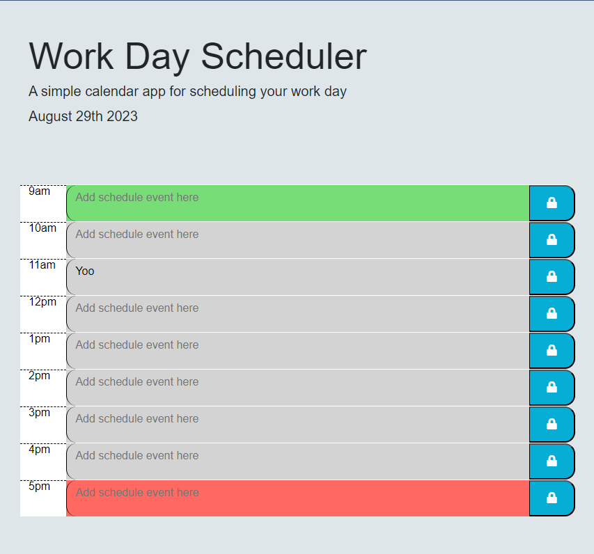

# Work Day Scheduler 
A work day planner that saves text inputs and color codes by the individual hour depending on if the the planner hour is in the past, present, or future. A past hour slot is grey, the current hour slot is red, and future hour slots are green.

## Contents
1. [About](#about)
    1. [User Story](#user%20story)
    2. [Acceptance Criteria](#acceptance%20criteria)
    3. [Screenshot](#screenshot)
2. [Setup](#setup)
3. [Credits](#credits)
4. [Contact](#contact)

### About
A basic calendar application that lets users save events to each hours' "slot" so they cna more effectively plan their day. This app runs in the browser and uses HTML, CSS, and Javascript that is dynamically altered by jQuery as time goes by in a day.
The Moment API is used to track the hours in the day. (https://momentjs.com/docs/)

### User Story
AS AN employee with a busy schedule
I WANT to add important events to a daily planner
SO THAT I can manage my time effectively

### Acceptance Criteria
GIVEN I am using a daily planner to create a schedule
WHEN I open the planner
THEN the current day is displayed at the top of the calendar
WHEN I scroll down
THEN I am presented with time blocks for standard business hours of 9am to 5pm
WHEN I view the time blocks for that day
THEN each time block is color-coded to indicate whether it is in the past, present, or future
WHEN I click into a time block
THEN I can enter an event
WHEN I click the save button for that time block
THEN the text for that event is saved in local storage
WHEN I refresh the page
THEN the saved events persist

### Screenshot



## Setup
To clone the repo:
```
git clone https://github.com/Jsterling56/Scheduler-Work-day
```

## Credits & Resources
Some code(script.js) taken from (https://github.com/jfisher396/workday-scheduler).
Helpful links used were Moment documentation(https://momentjs.com/docs/), jQuery documentation (https://api.jquery.com/), as well as the Bootstrap documentation (https://getbootstrap.com/docs/4.5/getting-started/introduction/).

## Contact
If you have questions or comments, please email me at jtsterlin6@gmail.com


